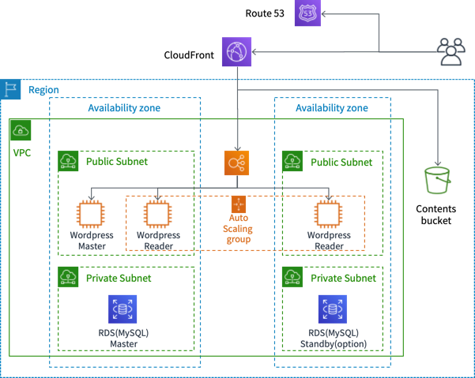

# **小規模 〜 中規模WordPress アーキテクチャ**

小から中規模向けのWordPress アーキテクチャを自動構成するCloudFormation Template を提供します。

***Note: WordPress のリファレンスアーキテクチャは [ここ](https://github.com/aws-samples/aws-refarch-wordpress) で提供されていますが、コストが高くなりがちですので、なるべく低コストで小規模〜中規模でも利用できるようなアーキテクチャにしています。より大規模で本格的に運用したい場合は、上記のレイファレンスアーキテクチャをご検討ください***

## 概要



- WordPress 用のEC2 インスタンスは2種類用意します。記事投稿や運用管理用のMaster インスタンスと、記事参照用のReader インスタンスです。  
Reader インスタンスはASG 構成とします。WordPress のアップデートやOS のパッチ更新などはMaster に対して実施します。Master からAMI を作成してReader 用のASG に適用するといった運用になります。   


- WordPress 前段には、Application Load Balancder(ALB) を配置します。管理系のリクエストは、Master インスタンスにルーティングし、その他のリクエストはASG 配下のReader インスタンスへルーティングするように設定します。
- ALB のDNS名 に対するリクエストは拒否するようにALB のリスナールールを設定します。これにより、ALB はCloudFront 経由からのリクエストのみを処理するようになります。 


- エンドユーザとCloudFront、CloudFront とALB 間は HTTPS で通信を行います。証明書はACM で管理します。  
  - エンドユーサ -- https --> CloudFront -- https --> ALB -- http --> WordPress  


- データベースはRDS (MySQL) を利用します。RDS のユーザ名/パスワードはSecrets Manager を利用して管理します。コストを考えて、Multi-AZ 構成はオプションで選択できるようにします。RDS が落ちてから復旧するまである程度時間が掛かってもよいという場合にはシングル構成がコスト効率が良いです。  


- 画像データはS3 に格納します。S3 用のWordPress のプラグインを構成します。  
- エンドユーザからのアクセスは、Route 53 で名前解決をしてCloudFront 経由でALB にリクエストをルーティングします。画像データの場合は、S3 にルーティングします。  

    ***Note***: 現状のテンプレートは**東京リージョンのみに対応**しています。   

## 前提
ブログの運用をするためのドメイン名がすでに決まっており、ドメインの取得およびRoute53 のホストゾーンがすでに完了しているとします。  
- 例: blog.example.com で運用する場合は、 example.com のドメイン取得及び、example.com のホストゾーンの設定がRoute 53 に設定済みである

ドメインの取得はRoute 53 でも可能です。以下のドキュメントが参考になります。(ただし、co.jp ドメインは取得できません。)  

- [新しいドメインの登録 - Amazon Route 53](https://docs.aws.amazon.com/ja_jp/Route53/latest/DeveloperGuide/domain-register.html)

Route53 を利用してドメインを登録すると、自動的にRoute 53 のホストゾーンも作成されます。なお１つのホストゾーンあたり0.5 ドル/月 の料金がかかりますのでご注意ください。    
すでに、どこかでドメイン取得済みの場合は、Route 53 のホストゾーンを設定します。以下のドキュメントが参考になります。

- [パブリックホストゾーンの作成 - Amazon Route 53](https://docs.aws.amazon.com/ja_jp/Route53/latest/DeveloperGuide/CreatingHostedZone.html)

## ACM での証明書の作成

WordPress ドメイン用の証明書を予め作成しておく必要があります。以下の２つが必要です。
- 東京リージョンにALB 用の証明書
- バージニア北部にCloufFront 用の証明書
  
証明書を作成したら、それぞれのARN を控えておいてください。


## 環境変数の設定

環境変数をセットします。

```sh

# Wordpress Settings
WORDPRESS_DOMAIN_NAME="Your_Domain_Name" # 適宜変更してください (ex: blog.example.com)
WORDPRESS_TITLE="Your_Blog_Title"  # 適宜変更してください
WORDPRESS_ADMIN_USERNAME="admin"  # 適宜変更してください
WORDPRESS_ADMIN_PASSWORD="Your_Admin_Password" # 適宜変更してください
WORDPRESS_ADMIN_EMAIL="yourmail@xxx.xx"  # 適宜変更してください

# CloudFormation Settings
WORDPRESS_STACK_NAME="WordPressMidArch"
TEMPLATES_BUCKET_NAME="your_template_bucket_name"  # 適宜変更してください
TEMPLATES_PREFIX="templates" # 適宜変更してください

# General AWS Settings
# RDS
RDS_MULTI_AZ_ENABLED="false"  # Multi-AZ 有効化したい場合はtrue
# S3
S3_CONTENTS_BUCKET_NAME="your_contents_bucket_name" # 適宜変更してください
S3_LOGS_BUCKET_NAME="your_logs_bucket_name" # 適宜変更してください
## ALB に設定するACM Certificate のARN を指定します。東京リージョンに作成してください。(blog.example.com で運用する場合はその証明書)
WEB_ACM_CERTIFICATE_ARN="arn:aws:acm:ap-northeast-1:<youraccunt>:certificate/xxxxxxxxx"
## CloudFront に設定するACM Certificate のARN を指定します。バージニア北部リージョンに作成してください。(blog.example.com で運用する場合はその証明書)
CF_ACM_CERTIFICATE_ARN="arn:aws:acm:us-east-1:<youraccunt>:certificate/xxxxxxxxx"
# Route 53 
ROUTE53_HOSTED_ZONE_ID="Your_Route53_Hosted_Zone_Id" # 適宜変更してください
```

## テンプレート用のバケット作成およびテンプレートのアップロード

以下のコマンドを実行してください。なおBucket 名はグローバルで一意である必要があります。

```
aws s3 mb s3://${TEMPLATES_BUCKET_NAME} --region ap-northeast-1
aws s3 cp templates/ s3://${TEMPLATES_BUCKET_NAME}/${TEMPLATES_PREFIX} --recursive --region ap-northeast-1
```

## 最小構成のWordPress Stack 作成

予め用意したMaster テンプレートを利用して、最小構成のWordPress 環境を構築できます。

```sh
aws cloudformation create-stack --stack-name ${WORDPRESS_STACK_NAME} \
    --template-body file://templates/wordpress-midarch-master.yaml \
    --parameters \
    ParameterKey=WPDomainName,ParameterValue="${WORDPRESS_DOMAIN_NAME}" \
    ParameterKey=WPTitle,ParameterValue="${WORDPRESS_TITLE}" \
    ParameterKey=WPAdminEmail,ParameterValue="${WORDPRESS_ADMIN_EMAIL}" \
    ParameterKey=WPAdminUsername,ParameterValue="${WORDPRESS_ADMIN_USERNAME}" \
    ParameterKey=WPAdminPassword,ParameterValue="${WORDPRESS_ADMIN_PASSWORD}" \
    ParameterKey=TemplatesBucketName,ParameterValue="${TEMPLATES_BUCKET_NAME}" \
    ParameterKey=TemplatesPrefix,ParameterValue="${TEMPLATES_PREFIX}" \
    ParameterKey=DBMultiAZBoolean,ParameterValue="${RDS_MULTI_AZ_ENABLED}" \
    ParameterKey=WordPressContentsS3BucketName,ParameterValue="${S3_CONTENTS_BUCKET_NAME}" \
    ParameterKey=WordPressLogsS3BucketName,ParameterValue="${S3_LOGS_BUCKET_NAME}" \
    ParameterKey=PublicAlbAcmCertificate,ParameterValue="${WEB_ACM_CERTIFICATE_ARN}" \
    ParameterKey=CloudFrontAcmCertificate,ParameterValue="${CF_ACM_CERTIFICATE_ARN}" \
    ParameterKey=WordPressServerDesiredCapacity,ParameterValue=0 \
    --capabilities CAPABILITY_NAMED_IAM
```


作成が完了するまで待機します。作成完了まで通常３０分ほどかかりますが、大部分はCloudFront の作成時間ですので、CloudFront Stack まで作成が進んでいたら次のRoute53 の設定に進んでも問題ありません。（その場合は15 分ぐらいです。）

```sh
aws cloudformation wait stack-create-complete --stack-name $WORDPRESS_STACK_NAME
```


上記のテンプレートでは、最小構成(インスタンスタイプがt2.microで、Readerは１インスタンスのみ) の構成となります。  
スケールを大きくしたい場合は、以下の点を変更してください。
- EC2 のインスタンスタイプ変更
  - wordpress-midarch-04-web.yaml の WordPressServerInstanceClass パラメータを指定
- Auto Scaling のMin/Max 変更
  - wordpress-midarch-04-web.yaml の WordPressServersAutoScalingGroup リソースのMinSize/MaxSize プロパティを適宜変更
- RDS のインスタンスタイプの変更
  - wordpress-midarch-02-rds.yaml の DBInstanceClass パラメータを指定


## Route 53 の構成

Route 53 はCFn ではなく CLI のみで設定します。以下のコマンドを実行してください。   
CloudFront Stack がまだ作成中の場合は、マネージメントコンソールでCloudFront の"Domain Name" をコピーして利用してください。


```sh
WORDPRESS_CF_DNSNAME=$(aws cloudformation describe-stacks --stack-name $WORDPRESS_STACK_NAME --query "Stacks[0].Outputs[?OutputKey == 'DnsEndpoint'].[OutputValue]" --output text)
echo $WORDPRESS_CF_DNSNAME

cat > create-recordset.json <<EOF
{
     "Comment": "Creating Alias resource record sets in Route 53",
     "Changes": [{
        "Action": "CREATE",
        "ResourceRecordSet": {
            "Name": "${WORDPRESS_DOMAIN_NAME}",
            "Type": "A",
            "AliasTarget":{
                    "HostedZoneId": "Z2FDTNDATAQYW2",
                    "DNSName": "${WORDPRESS_CF_DNSNAME}",
                    "EvaluateTargetHealth": false
                }}
            }]
}
EOF
```

レコードセットの作成

```

aws route53 change-resource-record-sets --hosted-zone-id ${ROUTE53_HOSTED_ZONE_ID} --change-batch file://create-recordset.json

```

作成状況の確認

```

aws route53  get-change --id /change/xxxxxx

```

以下のように Stuts が "INSYNC" であれば完了

```json
{
    "ChangeInfo": {
        "Status": "INSYNC", 
        "Comment": "Creating Alias resource record sets in Route 53", 
        "SubmittedAt": "2019-06-03T05:57:50.191Z", 
        "Id": "/change/xxxxxxx"
    }
}
```

## WordPress S3 Plugin の設定

すでにS3 Plugin (WP Offload Media Lite) はインストールされていますので、S3 と連携するように設定します。

1. 次のURL にアクセスする。

    https://${WORDPRESS_DOMAIN_NAME}/wp-admin/

2. WordPress 管理画面のプラグインをクリックして、"WP Offload Media Lite" の "有効化" リンクをクリックする。

3. "有効化" が "Settings" に変わるのでそのリンクをクリックする。

4. 次の画面で、"Browse existing buckets" リンクをクリックして、${S3_CONTENTS_BUCKET_NAME} にセットしたバケットを選択する。
5. "Sabe Selected Bucket" ボタンをクリックする
6. 次の画面で、以下を"on" にする
    - Custome Domain (CNAME)
      - ${WORDPRESS_DOMAIN_NAME} を入力する
    - Force HTTPS
    - Remove Files From Server
7. "Save Changes" ボタンをクリックする

これで、WordPress の構成は完了です。
実際に画像付きの記事を投稿してみて動作を確認しましょう。

## AMI を作成してAutoScaling Group にReader インスタンスを起動する

Master インスタンスのAMI を作成して、Web Stack に反映します。

```sh
# Get Latest WordPress Master InstanceId
LATEST_MASTER_INSTANCEID=$(aws ec2 describe-instances --filters "Name=tag:Name,Values=WordPressMasterServer,Name=tag:role,Values=master" --query "Reservations[].Instances[?State.Name != 'terminated'].[InstanceId, LaunchTime][] | sort_by(@, &[1]) | reverse(@)[0][0]" --output text)

# Create Image for WordPress Master Insatnce
NEW_AMI_NAME=WordPressServer-$(date "+%Y%m%d-%H%M%S")
NEW_AMI_ID=$(aws ec2 create-image --instance-id $LATEST_MASTER_INSTANCEID --name $NEW_AMI_NAME --query "ImageId" --output text)

# Create Tags to New AMI
aws ec2 create-tags --resources $NEW_AMI_ID --tags Key=Name,Value=$NEW_AMI_NAME

# wait for images to be available
aws ec2 wait image-available --image-ids $NEW_AMI_ID

# (Option) Delete old ami with keeping 4 generations
AMI_LIST=($(aws ec2 describe-images --filters "Name=tag:Name,Values=WordPressServer*" --query "Images[].[ImageId, CreationDate] | sort_by(@, &[1])[*][0]" --output text))
for ((i=0 ; i<${#AMI_LIST[@]}-4 ; i++))
do
echo Delete image: ${AMI_LIST[i]}
done

```


Web レイヤー Stack の更新を実施します。  
Desireted Capacity を任意の数に設定して、先ほど作成したAMI を指定してStack を更新します。  
UpdateStack を実行する際に、前回実行時と変わらないパラメータには**UsePreviousValue=true** をセットしておきます。こうすることで前回実行時のパラメータを別途用意する必要がありません。テンプレートが前回実行時と変わらない場合は、同じように **--use-previous-template** を指定することでテンプレートを別途用意する必要がなくなります。


```sh

WORDPRESS_SERVER_DESIRED_CAPACITY=1

aws cloudformation update-stack --stack-name ${WORDPRESS_STACK_NAME} \
    --use-previous-template \
    --parameters \
    ParameterKey=WordPressServerDesiredCapacity,ParameterValue=${WORDPRESS_SERVER_DESIRED_CAPACITY} \
    ParameterKey=WordPressAMI,ParameterValue=${NEW_AMI_ID} \
    ParameterKey=WPDomainName,UsePreviousValue=true \
    ParameterKey=WPTitle,UsePreviousValue=true \
    ParameterKey=WPAdminEmail,UsePreviousValue=true \
    ParameterKey=WPAdminUsername,UsePreviousValue=true \
    ParameterKey=WPAdminPassword,UsePreviousValue=true \
    ParameterKey=TemplatesBucketName,UsePreviousValue=true \
    ParameterKey=TemplatesPrefix,UsePreviousValue=true \
    ParameterKey=DBMultiAZBoolean,UsePreviousValue=true \
    ParameterKey=WordPressContentsS3BucketName,UsePreviousValue=true \
    ParameterKey=WordPressLogsS3BucketName,UsePreviousValue=true \
    ParameterKey=PublicAlbAcmCertificate,UsePreviousValue=true  \
    ParameterKey=CloudFrontAcmCertificate,UsePreviousValue=true  \
    --capabilities CAPABILITY_NAMED_IAM
```

この手順によるAMI の更新は、Master インスタンスのWordpress を更新したタイミングやプラグインを新たに入れたタイミングなどで実施します。
スクリプトを実行するだけなので、自動化も可能です。(CodePipeline や CodeBuild などを利用するとサーバレスで実現できます。)


# 環境の削除

環境が不要になった場合は、以下のコマンドを実行します。

```sh
# Delete Route 53 Record Set
cat > delete-recordset.json <<EOF
{
     "Comment": "Creating Alias resource record sets in Route 53",
     "Changes": [{
        "Action": "DELETE",
        "ResourceRecordSet": {
            "Name": "${WORDPRESS_DOMAIN_NAME}",
            "Type": "A",
            "AliasTarget":{
                    "HostedZoneId": "Z2FDTNDATAQYW2",
                    "DNSName": "${WORDPRESS_CF_DNSNAME}",
                    "EvaluateTargetHealth": false
                }}
            }]
}
EOF

aws route53 change-resource-record-sets --hosted-zone-id ${ROUTE53_HOSTED_ZONE_ID} --change-batch file://delete-recordset.json

# Delet WordPress Stack
aws cloudformation delete-stack --stack-name ${WORDPRESS_STACK_NAME} 

```

Stack 削除後も以下のものが残ります。不要な場合は削除してください。
- S3 バケット
- RDS スナップショット
- 作成したAMI


<BR><BR>

-------

# 個別にStack を作成する場合

以下のコマンドを実行することでそれぞれ個別にStack 作成ができます。

```sh
#Env Settings
# Network Stack Name
NW_STACK_NAME="WordPressNW"
# RDS Stack Name
RDS_STACK_NAME="WordPressRDS"
# S3 Stack Name
S3_STACK_NAME="WordPressS3"
# Web  Stack Name
WEB_STACK_NAME="WordPressWEB"
# Cloudfront Stack Name
CF_STACK_NAME="WordPressCF"
## CloudFront に設定するACM Certificate のARN を指定します。バージニア北部リージョンに作成してください。(blog.example.com で運用する場合はその証明書)
CF_ACM_CERTIFICATE_ARN="arn:aws:acm:us-east-1:<youraccunt>:certificate/xxxxxxxxx"

# Create NW Stack
aws cloudformation create-stack --stack-name $NW_STACK_NAME \
    --template-body file://templates/wordpress-midarch-01-nw.yaml
aws cloudformation wait stack-create-complete --stack-name $NW_STACK_NAME


# Create RDS Stack
PRIVATE_SUBNET1_ID=$(aws cloudformation describe-stacks --stack-name $NW_STACK_NAME --query "Stacks[0].Outputs[?OutputKey == 'PrivateSubnetId1'].[OutputValue]" --output text)
echo $PRIVATE_SUBNET1_ID
PRIVATE_SUBNET2_ID=$(aws cloudformation describe-stacks --stack-name $NW_STACK_NAME --query "Stacks[0].Outputs[?OutputKey == 'PrivateSubnetId2'].[OutputValue]" --output text)
echo $PRIVATE_SUBNET1_ID
DB_SECURITY_GROUP=$(aws cloudformation describe-stacks --stack-name $NW_STACK_NAME --query "Stacks[0].Outputs[?OutputKey == 'DBSecurityGroup'].[OutputValue]" --output text)
echo $DB_SECURITY_GROUP

aws cloudformation create-stack --stack-name $RDS_STACK_NAME \
    --template-body file://templates/wordpress-midarch-02-rds.yaml  \
    --parameters \
    ParameterKey=PrivateSubnetId1,ParameterValue=${PRIVATE_SUBNET1_ID} \
    ParameterKey=PrivateSubnetId2,ParameterValue=${PRIVATE_SUBNET2_ID} \
    ParameterKey=DBSecurityGroup,ParameterValue=${DB_SECURITY_GROUP} \
    ParameterKey=DBMasterUsername,ParameterValue=${RDS_MASTER_USER_NAME} \
    ParameterKey=DBMasterUserPassword,ParameterValue=${RDS_MASTER_USER_PASSWORD} \
    ParameterKey=DBMultiAZBoolean,ParameterValue=${RDS_MULTI_AZ_ENABLED}
aws cloudformation wait stack-create-complete --stack-name $RDS_STACK_NAME

# Create S3 Stack
aws cloudformation create-stack --stack-name $S3_STACK_NAME \
    --template-body file://templates/wordpress-midarch-03-s3.yaml  \
    --parameters \
    ParameterKey=WordPressContentsS3BucketName,ParameterValue=${S3_CONTENTS_BUCKET_NAME} \
    ParameterKey=WordPressLogsS3BucketName,ParameterValue=${S3_LOGS_BUCKET_NAME}
aws cloudformation wait stack-create-complete --stack-name $S3_STACK_NAME 

# Create Web Stack
VPC_ID=$(aws cloudformation describe-stacks --stack-name $NW_STACK_NAME --query "Stacks[0].Outputs[?OutputKey == 'VPCId'].[OutputValue]" --output text)
echo $VPC_ID
PUBLIC_SUBNET_ID1=$(aws cloudformation describe-stacks --stack-name $NW_STACK_NAME --query "Stacks[0].Outputs[?OutputKey == 'PublicSubnetId1'].[OutputValue]" --output text)
echo $PUBLIC_SUBNET_ID1
PUBLIC_SUBNET_ID2=$(aws cloudformation describe-stacks --stack-name $NW_STACK_NAME --query "Stacks[0].Outputs[?OutputKey == 'PublicSubnetId2'].[OutputValue]" --output text)
echo $PUBLIC_SUBNET_ID2
LB_SECURITY_GROUP=$(aws cloudformation describe-stacks --stack-name $NW_STACK_NAME --query "Stacks[0].Outputs[?OutputKey == 'LBSecurityGroup'].[OutputValue]" --output text)
echo $LB_SECURITY_GROUP
WEB_SECURITY_GROUP=$(aws cloudformation describe-stacks --stack-name $NW_STACK_NAME --query "Stacks[0].Outputs[?OutputKey == 'WebSecurityGroup'].[OutputValue]" --output text)
echo $WEB_SECURITY_GROUP
RDS_SECRET=$(aws cloudformation describe-stacks --stack-name $RDS_STACK_NAME --query "Stacks[0].Outputs[?OutputKey == 'RDSSecret'].[OutputValue]" --output text)
echo $RDS_SECRET

aws cloudformation create-stack --stack-name $WEB_STACK_NAME \
    --template-body file://templates/wordpress-midarch-04-web.yaml \
    --parameters \
    ParameterKey=VPCId,ParameterValue=${VPC_ID} \
    ParameterKey=PublicSubnetId1,ParameterValue=${PUBLIC_SUBNET_ID1} \
    ParameterKey=PublicSubnetId2,ParameterValue=${PUBLIC_SUBNET_ID2} \
    ParameterKey=LBSecurityGroup,ParameterValue=${LB_SECURITY_GROUP} \
    ParameterKey=WebSecurityGroup,ParameterValue=${WEB_SECURITY_GROUP} \
    ParameterKey=WordPressContentsS3BucketName,ParameterValue=${S3_CONTENTS_BUCKET_NAME} \
    ParameterKey=WordPressLogsS3BucketName,ParameterValue=${S3_LOGS_BUCKET_NAME}  \
    ParameterKey=RDSSecret,ParameterValue=${RDS_SECRET}  \
    ParameterKey=PublicAlbAcmCertificate,ParameterValue=${WEB_ACM_CERTIFICATE_ARN}  \
    ParameterKey=WordPressServerDesiredCapacity,ParameterValue=0 \
    ParameterKey=WPDomainName,ParameterValue=${WORDPRESS_DOMAIN_NAME} \
    ParameterKey=WPTitle,ParameterValue=${WORDPRESS_TITLE} \
    ParameterKey=WPAdminEmail,ParameterValue=${WORDPRESS_ADMIN_EMAIL} \
    ParameterKey=WPAdminUsername,ParameterValue=${WORDPRESS_ADMIN_USERNAME} \
    ParameterKey=WPAdminPassword,ParameterValue=${WORDPRESS_ADMIN_PASSWORD} \
    --capabilities CAPABILITY_NAMED_IAM
aws cloudformation wait stack-create-complete --stack-name $WEB_STACK_NAME

# CloudFront Stack
WORDPRESS_ALB_DNS_NAME=$(aws cloudformation describe-stacks --stack-name $WEB_STACK_NAME --query "Stacks[0].Outputs[?OutputKey == 'WordPressALBDnsName'].[OutputValue]" --output text)
echo $WORDPRESS_ALB_DNS_NAME

aws cloudformation create-stack --stack-name $CF_STACK_NAME \
    --template-body file://templates/wordpress-midarch-05-cloudfront.yaml \
    --parameters \
    ParameterKey=WordPressContentsS3BucketName,ParameterValue=${S3_CONTENTS_BUCKET_NAME} \
    ParameterKey=CloudFrontAcmCertificate,ParameterValue=${CF_ACM_CERTIFICATE_ARN}  \
    ParameterKey=WPDomainName,ParameterValue=${WORDPRESS_DOMAIN_NAME} \
    ParameterKey=WordPressALBDnsName,ParameterValue=${WORDPRESS_ALB_DNS_NAME}
aws cloudformation wait stack-create-complete --stack-name $CF_STACK_NAME

# Route 53 Setting
WORDPRESS_CF_DNSNAME=$(aws cloudformation describe-stacks --stack-name $CF_STACK_NAME --query "Stacks[0].Outputs[?OutputKey == 'DnsEndpoint'].[OutputValue]" --output text)
echo $WORDPRESS_CF_DNSNAME

cat > create-recordset.json <<EOF
{
     "Comment": "Creating Alias resource record sets in Route 53",
     "Changes": [{
        "Action": "CREATE",
        "ResourceRecordSet": {
            "Name": "${WORDPRESS_DOMAIN_NAME}",
            "Type": "A",
            "AliasTarget":{
                    "HostedZoneId": "Z2FDTNDATAQYW2",
                    "DNSName": "${WORDPRESS_CF_DNSNAME}",
                    "EvaluateTargetHealth": false
                }}
            }]
}
EOF
aws route53 change-resource-record-sets --hosted-zone-id ${ROUTE53_HOSTED_ZONE_ID} --change-batch file://create-recordset.json

```

このあとは、WordPress S3 Plugin の設定をします、AMI を作成します。

- S3 Plugin 設定は、上記内容と一緒

AMI の再構成をしてWeb Stack を更新します。

```sh
# Get Latest WordPress Master InstanceId
LATEST_MASTER_INSTANCEID=$(aws ec2 describe-instances --filters "Name=tag:Name,Values=WordPressMasterServer,Name=tag:role,Values=master" --query "Reservations[].Instances[?State.Name != 'terminated'].[InstanceId, LaunchTime][] | sort_by(@, &[1]) | reverse(@)[0][0]" --output text)

# Create Image for WordPress Master Insatnce
NEW_AMI_NAME=WordPressServer-$(date "+%Y%m%d-%H%M%S")
NEW_AMI_ID=$(aws ec2 create-image --instance-id $LATEST_MASTER_INSTANCEID --name $NEW_AMI_NAME --query "ImageId" --output text)

# Create Tags to New AMI
aws ec2 create-tags --resources $NEW_AMI_ID --tags Key=Name,Value=$NEW_AMI_NAME

# wait for images to be available
aws ec2 wait image-available --image-ids $NEW_AMI_ID

# (Option) Delete old ami with keeping 4 generations
AMI_LIST=($(aws ec2 describe-images --filters "Name=tag:Name,Values=WordPressServer*" --query "Images[].[ImageId, CreationDate] | sort_by(@, &[1])[*][0]" --output text))
for ((i=0 ; i<${#AMI_LIST[@]}-4 ; i++))
do
echo Delete image: ${AMI_LIST[i]}
done

# Update Web Stack
WORDPRESS_SERVER_DESIRED_CAPACITY=1

aws cloudformation update-stack --stack-name $WEB_STACK_NAME \
    --use-previous-template \
    --parameters \
    ParameterKey=WordPressServerDesiredCapacity,ParameterValue=${WORDPRESS_SERVER_DESIRED_CAPACITY} \
    ParameterKey=WordPressAMI,ParameterValue=${NEW_AMI_ID} \
    ParameterKey=VPCId,UsePreviousValue=true \
    ParameterKey=PublicSubnetId1,UsePreviousValue=true \
    ParameterKey=PublicSubnetId2,UsePreviousValue=true \
    ParameterKey=LBSecurityGroup,UsePreviousValue=true \
    ParameterKey=WebSecurityGroup,UsePreviousValue=true \
    ParameterKey=WordPressContentsS3BucketName,UsePreviousValue=true \
    ParameterKey=WordPressLogsS3BucketName,UsePreviousValue=true  \
    ParameterKey=RDSSecret,UsePreviousValue=true  \
    ParameterKey=PublicAlbAcmCertificate,UsePreviousValue=true  \
    ParameterKey=WPDomainName,UsePreviousValue=true \
    ParameterKey=WPTitle,UsePreviousValue=true \
    ParameterKey=WPAdminEmail,UsePreviousValue=true \
    ParameterKey=WPAdminUsername,UsePreviousValue=true \
    ParameterKey=WPAdminPassword,UsePreviousValue=true \
    --capabilities CAPABILITY_NAMED_IAM
```
