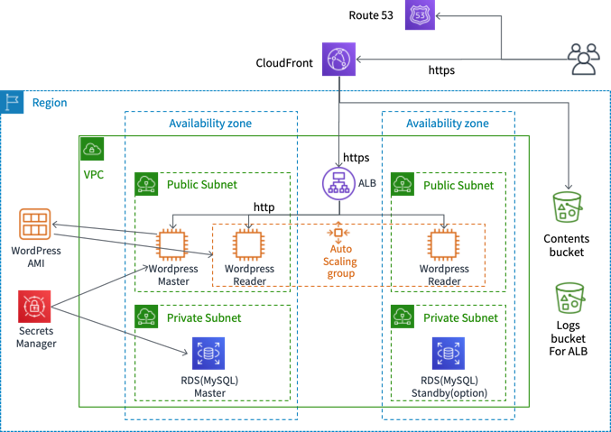

# **小規模 〜 中規模WordPress アーキテクチャ**

中規模向けのWordPress アーキテクチャを自動構成するCloudFormation Template を提供します。
WordPress のリファレンスアーキテクチャは以下のURL で提供されていますが、コストが高くなりがちですので、なるべく低コストで小規模〜中規模でも利用できるようなアーキテクチャにしています。  


[https://github.com/aws-samples/aws-refarch-wordpress](https://github.com/aws-samples/aws-refarch-wordpress)


## 概要



WordPress 用のEC2 インスタンスは2種類用意します。記事投稿や運用管理ようのMaster インスタンスと記事参照用のReader インスタンスです。Reader インスタンスはASG 構成とします。WordPress のアップデートやOS のパッチ更新などはMaster に対して実施します。Master からAMI を作成してReader 用のASG に適用するといった運用になります。  
WordPress 前段には、Application Load Balancder(ALB) を配置します。管理系のリクエストは、Master インスタンスにルーティングし、その他のリクエストはASG 配下のReader インスタンスへルーティングするように設定します。
データベースはRDS (MySQL) を利用します。コストを考えて、Multi-AZ 構成はオプションで選択できるようにします。RDS が落ちてから復旧するまである程度時間が掛かってもよいという場合にはシングル構成がコスト効率が良いです。  
画像データはS3 に格納します。その際にWordPress のプラグインを構成します。  
エンドユーザからのアクセスは、Route 53 で名前解決をしてCloudFront 経由でALB にリクエストをルーティングします。画像データの場合は、S3 にルーティングします。  

なお、現状のテンプレートは**東京リージョンのみ対応**しています。   

今回の手順では、各Stack を個別に作成していますが、各Stack は関連するStack の情報をパラメータで受け取るようにしているため、Nest 構造にして一度にすべてを構成することも可能です。

## 前提
ブログの運用をするためのドメイン名がすでに決まっており、ドメインの取得およびRoute53 のホストゾーンがすでに完了しているとします。  
- 例: blog.example.com で運用する場合は、 example.com のドメイン取得及び、example.com のホストゾーンの設定がRoute 53 に設定済みである

ドメインの取得はRoute 53 でも可能です。以下のドキュメントが参考になります。(ただし、co.jp ドメインは取得できません。)  

- [新しいドメインの登録 - Amazon Route 53](https://docs.aws.amazon.com/ja_jp/Route53/latest/DeveloperGuide/domain-register.html)

Route53 を利用してドメインを登録すると、自動的にRoute 53 のホストゾーンも作成されます。なお１つのホストゾーンあたり0.5 ドル/月 の料金がかかりますのでご注意ください。    
すでに、どこかでドメイン取得済みの場合は、Route 53 のホストゾーンを設定します。以下のドキュメントが参考になります。

- [パブリックホストゾーンの作成 - Amazon Route 53](https://docs.aws.amazon.com/ja_jp/Route53/latest/DeveloperGuide/CreatingHostedZone.html)

## 環境変数の設定

まずは環境変数をセットします。

```sh
# Network
NW_STACK_NAME="WordPressNW"
# RDS
RDS_STACK_NAME="WordPressRDS"
RDS_MASTER_USER_NAME="wpuser" 
RDS_MASTER_USER_PASSWORD="rewrite_this_with_your_password" # 適宜変更してください
RDS_MULTI_AZ_ENABLED="false"  # Multi-AZ 有効化したい場合はtrue
# S3
S3_STACK_NAME="WordPressS3"
S3_CONTENTS_BUCKET_NAME="your_contents_bucket_name" # 適宜変更してください
S3_LOGS_BUCKET_NAME="your_logs_bucket_name" # 適宜変更してください
# Web (ALB&ASG&MasterServer)
WEB_STACK_NAME="WordPressWEB"
## ALB に設定するACM Certificate のARN を指定します。東京リージョンに作成してください。(blog.example.com で運用する場合はその証明書)
WEB_ACM_CERTIFICATE_ARN="arn:aws:acm:ap-northeast-1:<youraccunt>:certificate/xxxxxxxxx"
# Wordpress Setting
WORDPRESS_TITLE="Your_Blog_Title"  # 適宜変更してください
WORDPRESS_DOMAIN_NAME="Your_Domain_Name" # 適宜変更してください
WORDPRESS_ADMIN_USERNAME="admin"  # 適宜変更してください
WORDPRESS_ADMIN_PASSWORD="Your_Admin_Password" # 適宜変更してください
WORDPRESS_ADMIN_EMAIL="yourmail@xxx.xx"  # 適宜変更してください
# Cloudfront
CF_STACK_NAME="WordPressCF"
## CloudFront に設定するACM Certificate のARN を指定します。バージニア北部リージョンに作成してください。(blog.example.com で運用する場合はその証明書)
CF_ACM_CERTIFICATE_ARN="arn:aws:acm:us-east-1:<youraccunt>:certificate/xxxxxxxxx"
# Route 53 
ROUTE53_HOSTED_ZONE_ID="Your_Route53_Hosted_Zone_Id" # 適宜変更してください
```

## Network stack 作成

以下のコマンドでNetwork Stack を作成します。

```
aws cloudformation create-stack --stack-name $NW_STACK_NAME \
    --template-body file://templates/wordpress-midarch-01-nw.yaml
```

作成が完了するまで待機します。

```sh
aws cloudformation wait stack-create-complete --stack-name $NW_STACK_NAME
```

## RDS Stack の作成

以下のコマンドでRDS Stack を作成します。

```sh

PRIVATE_SUBNET1_ID=$(aws cloudformation describe-stacks --stack-name $NW_STACK_NAME --query "Stacks[0].Outputs[?OutputKey == 'PrivateSubnetId1'].[OutputValue]" --output text)
echo $PRIVATE_SUBNET1_ID
PRIVATE_SUBNET2_ID=$(aws cloudformation describe-stacks --stack-name $NW_STACK_NAME --query "Stacks[0].Outputs[?OutputKey == 'PrivateSubnetId2'].[OutputValue]" --output text)
echo $PRIVATE_SUBNET1_ID
DB_SECURITY_GROUP=$(aws cloudformation describe-stacks --stack-name $NW_STACK_NAME --query "Stacks[0].Outputs[?OutputKey == 'DBSecurityGroup'].[OutputValue]" --output text)
echo $DB_SECURITY_GROUP

aws cloudformation create-stack --stack-name $RDS_STACK_NAME \
    --template-body file://templates/wordpress-midarch-02-rds.yaml  \
    --parameters \
    ParameterKey=PrivateSubnetId1,ParameterValue=${PRIVATE_SUBNET1_ID} \
    ParameterKey=PrivateSubnetId2,ParameterValue=${PRIVATE_SUBNET2_ID} \
    ParameterKey=DBSecurityGroup,ParameterValue=${DB_SECURITY_GROUP} \
    ParameterKey=DBMasterUsername,ParameterValue=${RDS_MASTER_USER_NAME} \
    ParameterKey=DBMasterUserPassword,ParameterValue=${RDS_MASTER_USER_PASSWORD} \
    ParameterKey=DBMultiAZBoolean,ParameterValue=${RDS_MULTI_AZ_ENABLED}
```

作成が完了するまで待機します。

```sh
aws cloudformation wait stack-create-complete --stack-name $RDS_STACK_NAME
```

## S3 Stack の作成

WordPress に投稿する画像データおよび、ALB のログを格納するS3 バケットを作成します。

```sh
aws cloudformation create-stack --stack-name $S3_STACK_NAME \
    --template-body file://templates/wordpress-midarch-03-s3.yaml  \
    --parameters \
    ParameterKey=WordPressContentsS3BucketName,ParameterValue=${S3_CONTENTS_BUCKET_NAME} \
    ParameterKey=WordPressLogsS3BucketName,ParameterValue=${S3_LOGS_BUCKET_NAME}
```

作成が完了するまで待機します。

```sh
aws cloudformation wait stack-create-complete --stack-name $S3_STACK_NAME 
```

## Web Stack の作成

まずは、WordPress 構成のためにALB と Master Instance のみを起動します。(Reader 用のDesired Capacity を０で起動)

```sh

VPC_ID=$(aws cloudformation describe-stacks --stack-name $NW_STACK_NAME --query "Stacks[0].Outputs[?OutputKey == 'VPCId'].[OutputValue]" --output text)
echo $VPC_ID
PUBLIC_SUBNET_ID1=$(aws cloudformation describe-stacks --stack-name $NW_STACK_NAME --query "Stacks[0].Outputs[?OutputKey == 'PublicSubnetId1'].[OutputValue]" --output text)
echo $PUBLIC_SUBNET_ID1
PUBLIC_SUBNET_ID2=$(aws cloudformation describe-stacks --stack-name $NW_STACK_NAME --query "Stacks[0].Outputs[?OutputKey == 'PublicSubnetId2'].[OutputValue]" --output text)
echo $PUBLIC_SUBNET_ID2
LB_SECURITY_GROUP=$(aws cloudformation describe-stacks --stack-name $NW_STACK_NAME --query "Stacks[0].Outputs[?OutputKey == 'LBSecurityGroup'].[OutputValue]" --output text)
echo $LB_SECURITY_GROUP
WEB_SECURITY_GROUP=$(aws cloudformation describe-stacks --stack-name $NW_STACK_NAME --query "Stacks[0].Outputs[?OutputKey == 'WebSecurityGroup'].[OutputValue]" --output text)
echo $WEB_SECURITY_GROUP
RDS_ENDPOINT_ADDRESS=$(aws cloudformation describe-stacks --stack-name $RDS_STACK_NAME --query "Stacks[0].Outputs[?OutputKey == 'RDSEndpointAddress'].[OutputValue]" --output text)
echo $RDS_ENDPOINT_ADDRESS

aws cloudformation create-stack --stack-name $WEB_STACK_NAME \
    --template-body file://templates/wordpress-midarch-04-web.yaml \
    --parameters \
    ParameterKey=VPCId,ParameterValue=${VPC_ID} \
    ParameterKey=PublicSubnetId1,ParameterValue=${PUBLIC_SUBNET_ID1} \
    ParameterKey=PublicSubnetId2,ParameterValue=${PUBLIC_SUBNET_ID2} \
    ParameterKey=LBSecurityGroup,ParameterValue=${LB_SECURITY_GROUP} \
    ParameterKey=WebSecurityGroup,ParameterValue=${WEB_SECURITY_GROUP} \
    ParameterKey=WordPressContentsS3BucketName,ParameterValue=${S3_CONTENTS_BUCKET_NAME} \
    ParameterKey=WordPressLogsS3BucketName,ParameterValue=${S3_LOGS_BUCKET_NAME}  \
    ParameterKey=PublicAlbAcmCertificate,ParameterValue=${WEB_ACM_CERTIFICATE_ARN}  \
    ParameterKey=WordPressServerDesiredCapacity,ParameterValue=0 \
    ParameterKey=DBMasterUsername,ParameterValue=${RDS_MASTER_USER_NAME} \
    ParameterKey=DBMasterUserPassword,ParameterValue=${RDS_MASTER_USER_PASSWORD} \
    ParameterKey=RDSEndpointAddress,ParameterValue=${RDS_ENDPOINT_ADDRESS} \
    ParameterKey=WPDomainName,ParameterValue=${WORDPRESS_DOMAIN_NAME} \
    ParameterKey=WPTitle,ParameterValue=${WORDPRESS_TITLE} \
    ParameterKey=WPAdminEmail,ParameterValue=${WORDPRESS_ADMIN_EMAIL} \
    ParameterKey=WPAdminUsername,ParameterValue=${WORDPRESS_ADMIN_USERNAME} \
    ParameterKey=WPAdminPassword,ParameterValue=${WORDPRESS_ADMIN_PASSWORD} \
    --capabilities CAPABILITY_NAMED_IAM
```

作成が完了するまで待機します。

```sh
aws cloudformation wait stack-create-complete --stack-name $WEB_STACK_NAME
```

## CloudFront Stack の作成

```sh
WORDPRESS_ALB_DNS_NAME=$(aws cloudformation describe-stacks --stack-name $WEB_STACK_NAME --query "Stacks[0].Outputs[?OutputKey == 'WordPressALBDnsName'].[OutputValue]" --output text)
echo $WORDPRESS_ALB_DNS_NAME

aws cloudformation create-stack --stack-name $CF_STACK_NAME \
    --template-body file://templates/wordpress-midarch-05-cloudfront.yaml \
    --parameters \
    ParameterKey=WordPressContentsS3BucketName,ParameterValue=${S3_CONTENTS_BUCKET_NAME} \
    ParameterKey=CloudFrontAcmCertificate,ParameterValue=${CF_ACM_CERTIFICATE_ARN}  \
    ParameterKey=WPDomainName,ParameterValue=${WORDPRESS_DOMAIN_NAME} \
    ParameterKey=WordPressALBDnsName,ParameterValue=${WORDPRESS_ALB_DNS_NAME}
```

作成が完了するまで待機します。  
CloudFront の構成が完了するにはかなり時間がかかりますが、待たずに次のRoute 53 の構成を開始することも可能です。その際は、CloudFront のDNS 名は、マネージメントコンソールなどで確認してください。

```sh
aws cloudformation wait stack-create-complete --stack-name $CF_STACK_NAME
```

## Route 53 の構成

Route 53 はCLI のみで設定します。


```sh
WORDPRESS_CF_DNSNAME=$(aws cloudformation describe-stacks --stack-name $CF_STACK_NAME --query "Stacks[0].Outputs[?OutputKey == 'DnsEndpoint'].[OutputValue]" --output text)
echo $WORDPRESS_CF_DNSNAME

cat > create-recordset.json <<EOF
{
     "Comment": "Creating Alias resource record sets in Route 53",
     "Changes": [{
        "Action": "CREATE",
        "ResourceRecordSet": {
            "Name": "${WORDPRESS_DOMAIN_NAME}",
            "Type": "A",
            "AliasTarget":{
                    "HostedZoneId": "Z2FDTNDATAQYW2",
                    "DNSName": "${WORDPRESS_CF_DNSNAME}",
                    "EvaluateTargetHealth": false
                }}
            }]
}
EOF
```

レコードセットの作成

```

aws route53 change-resource-record-sets --hosted-zone-id ${ROUTE53_HOSTED_ZONE_ID} --change-batch file://create-recordset.json

```

作成状況の確認

```

aws route53  get-change --id /change/xxxxxx

```

以下のように Stuts が "INSYNC" であれば完了

```json
{
    "ChangeInfo": {
        "Status": "INSYNC", 
        "Comment": "Creating Alias resource record sets in Route 53", 
        "SubmittedAt": "2019-06-03T05:57:50.191Z", 
        "Id": "/change/xxxxxxx"
    }
}
```

## WordPress S3 Plugin の設定

すでにS3 Plubli (WP Offload Media Lite) はインストールされていますので、S3 と連携するように設定します。

1. 次のURL にアクセスする。

    https://${WORDPRESS_DOMAIN_NAME}/wp-admin/

2. WordPress 管理画面のプラグインをクリックして、"WP Offload Media Lite" の "有効化" リンクをクリックする。

3. "有効化" が "Settings" に変わるのでそのリンクをクリックする。

4. 次の画面で、"Browse existing buckets" リンクをクリックして、${S3_CONTENTS_BUCKET_NAME} にセットしたバケットを選択する。
5. "Sabe Selected Bucket" ボタンをクリックする
6. 次の画面で、以下を"on" にする
    - Custome Domain (CNAME)
      - ${WORDPRESS_DOMAIN_NAME} を入力する
    - Force HTTPS
    - Remove Files From Server
7. "Save Changes" ボタンをクリックする

これで、WordPress の構成は完了です。
実際に画像付きの記事を投稿してみて動作を確認しましょう。

## AMI を作成してAutoScaling Group にReader インスタンスを起動する

Master インスタンスのAMI を作成して、Web Stack に反映します。

```sh
# Get Latest Corp Blog Master InstanceId
LATEST_MASTER_INSTANCEID=$(aws ec2 describe-instances --filters "Name=tag:Name,Values=WordPressMasterServer,Name=tag:role,Values=master" --query "Reservations[].Instances[?State.Name != 'terminated'].[InstanceId, LaunchTime][] | sort_by(@, &[1]) | reverse(@)[0][0]" --output text)

# Create Image for CorpBlog Master Insatnce
NEW_AMI_NAME=WordPressServer-$(date "+%Y%m%d-%H%M%S")
NEW_AMI_ID=$(aws ec2 create-image --instance-id $LATEST_MASTER_INSTANCEID --name $NEW_AMI_NAME --query "ImageId" --output text)

# Create Tags to New AMI
aws ec2 create-tags --resources $NEW_AMI_ID --tags Key=Name,Value=$NEW_AMI_NAME

# wait for images to be available
aws ec2 wait image-available --image-ids $NEW_AMI_ID

# (Option) Delete old ami keeping 4 generations
AMI_LIST=($(aws ec2 describe-images --filters "Name=tag:Name,Values=WordPressServer*" --query "Images[].[ImageId, CreationDate] | sort_by(@, &[1])[*][0]" --output text))
for ((i=0 ; i<${#AMI_LIST[@]}-4 ; i++))
do
echo Delete image: ${AMI_LIST[i]}
done

```

Web レイヤー Stack の更新を実施します。
Desireted Capacity を任意の数に設定して、先ほど作成したAMI を指定してStack を更新します。

```sh

WORDPRESS_SERVER_DESIRED_CAPACITY=1

aws cloudformation update-stack --stack-name $WEB_STACK_NAME \
    --template-body file://templates/wordpress-midarch-04-web.yaml \
    --parameters \
    ParameterKey=VPCId,ParameterValue=${VPC_ID} \
    ParameterKey=WordPressAMI,ParameterValue=${NEW_AMI_ID} \
    ParameterKey=PublicSubnetId1,ParameterValue=${PUBLIC_SUBNET_ID1} \
    ParameterKey=PublicSubnetId2,ParameterValue=${PUBLIC_SUBNET_ID2} \
    ParameterKey=LBSecurityGroup,ParameterValue=${LB_SECURITY_GROUP} \
    ParameterKey=WebSecurityGroup,ParameterValue=${WEB_SECURITY_GROUP} \
    ParameterKey=WordPressContentsS3BucketName,ParameterValue=${S3_CONTENTS_BUCKET_NAME} \
    ParameterKey=WordPressLogsS3BucketName,ParameterValue=${S3_LOGS_BUCKET_NAME}  \
    ParameterKey=PublicAlbAcmCertificate,ParameterValue=${WEB_ACM_CERTIFICATE_ARN}  \
    ParameterKey=WordPressServerDesiredCapacity,ParameterValue=${WORDPRESS_SERVER_DESIRED_CAPACITY} \
    ParameterKey=DBMasterUsername,ParameterValue=${RDS_MASTER_USER_NAME} \
    ParameterKey=DBMasterUserPassword,ParameterValue=${RDS_MASTER_USER_PASSWORD} \
    ParameterKey=RDSEndpointAddress,ParameterValue=${RDS_ENDPOINT_ADDRESS} \
    ParameterKey=WPDomainName,ParameterValue=${WORDPRESS_DOMAIN_NAME} \
    ParameterKey=WPTitle,ParameterValue=${WORDPRESS_TITLE} \
    ParameterKey=WPAdminEmail,ParameterValue=${WORDPRESS_ADMIN_EMAIL} \
    ParameterKey=WPAdminUsername,ParameterValue=${WORDPRESS_ADMIN_USERNAME} \
    ParameterKey=WPAdminPassword,ParameterValue=${WORDPRESS_ADMIN_PASSWORD} \
    --capabilities CAPABILITY_NAMED_IAM
```

この手順によるAMI の更新は、Master インスタンスのWordpress を更新したタイミングやプラグインを新たに入れたタイミングなどで実施します。
スクリプトを実行するだけなので、自動化も可能です。(CodePipeline や CodeBuild などを利用するとサーバレスで実現できます。)
